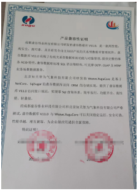

# Weave.XuguCore

#### 介绍
北京知天智为气象科技有限公司研发的Weave.XuguCore是基于NetCore、SqlSugar的虚谷数据库访问 ORM 的仓储实现，提供了虚谷数据库V11.0访问接口规范，实现零Sql查询体系，简单易用、功能齐全、高性能、轻量级。

#### 安装教程
搜索 SqlSugar.XuguCore
下载NUGET包到本地
 

#### 使用说明
与SqlSugar 的使用一致，是SqlSugar 的数据库支持的一种实现。

 https://www.donet5.com/Home/Doc

 
   